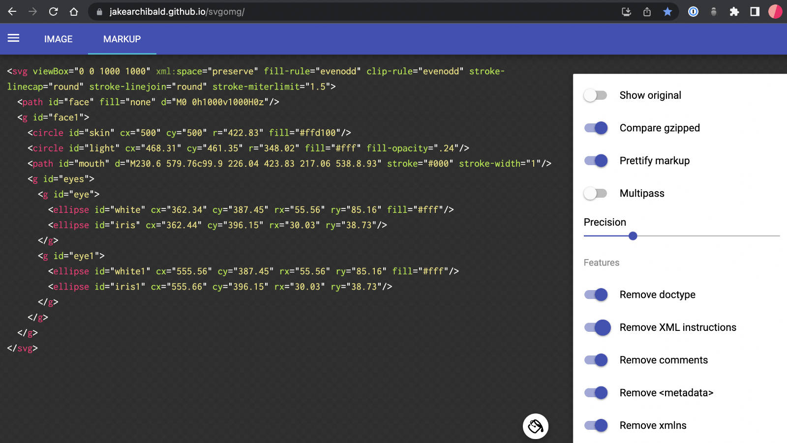
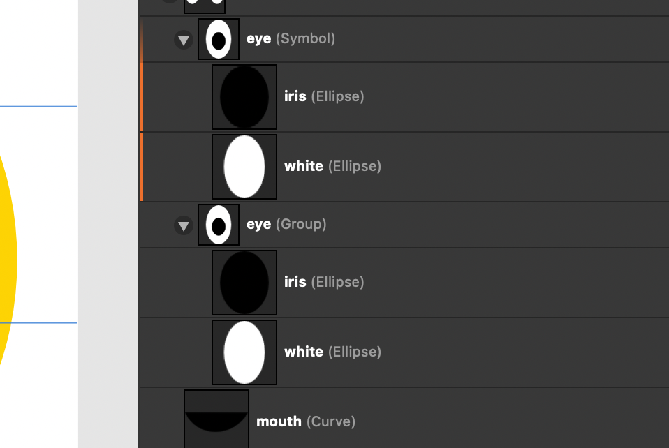

# Affinity Designer SVG export notes

Some notes to help explain our desires regarging Affinity Designer SVG export feature requests.

## Goal


**Ultimate goal**: Get as close to our desired final SVG export code as possible, with the least friction.

**Goal of _these notes_**: Clearly explain what currently happens and what we would _like_ to have happen.


## Story

We created a fairly basic graphic.


```html
<?xml version="1.0" encoding="UTF-8" standalone="no"?><!DOCTYPE svg PUBLIC "-//W3C//DTD SVG 1.1//EN" "http://www.w3.org/Graphics/SVG/1.1/DTD/svg11.dtd"><svg width="100%" height="100%" viewBox="0 0 1000 1000" version="1.1" xmlns="http://www.w3.org/2000/svg" xmlns:xlink="http://www.w3.org/1999/xlink" xml:space="preserve" xmlns:serif="http://www.serif.com/" style="fill-rule:evenodd;clip-rule:evenodd;stroke-linecap:round;stroke-linejoin:round;stroke-miterlimit:1.5;"><rect id="face" x="0" y="0" width="1000" height="1000" style="fill:none;"/><g id="face1" serif:id="face"><circle id="skin" cx="500" cy="500" r="422.83" style="fill:#ffd100;"/><circle id="light" cx="468.312" cy="461.347" r="348.022" style="fill:#fff;fill-opacity:0.24;"/><path id="mouth" d="M230.603,579.763c99.888,226.033 423.824,217.054 538.794,0.928" style="stroke:#000;stroke-width:1px;"/><g id="eyes"><g id="eye"><ellipse id="white" cx="362.343" cy="387.447" rx="55.561" ry="85.158" style="fill:#fff;"/><ellipse id="iris" cx="362.441" cy="396.152" rx="30.026" ry="38.731"/></g><g id="eye1" serif:id="eye"><ellipse id="white1" serif:id="white" cx="555.561" cy="387.447" rx="55.561" ry="85.158" style="fill:#fff;"/><ellipse id="iris1" serif:id="iris" cx="555.659" cy="396.152" rx="30.026" ry="38.731"/></g></g></g></svg>
```

(assumes some ideal output settings)

This has been indented to show multiline:

```html
<?xml version="1.0" encoding="UTF-8" standalone="no"?>

<!DOCTYPE svg PUBLIC "-//W3C//DTD SVG 1.1//EN" "http://www.w3.org/Graphics/SVG/1.1/DTD/svg11.dtd">

<svg width="100%" height="100%" viewBox="0 0 1000 1000" version="1.1" xmlns="http://www.w3.org/2000/svg" xmlns:xlink="http://www.w3.org/1999/xlink" xml:space="preserve" xmlns:serif="http://www.serif.com/" style="fill-rule:evenodd;clip-rule:evenodd;stroke-linecap:round;stroke-linejoin:round;stroke-miterlimit:1.5;">

    <rect id="face" x="0" y="0" width="1000" height="1000" style="fill:none;"/>

	<g id="face1" serif:id="face">

		<circle id="skin" cx="500" cy="500" r="422.83" style="fill:#ffd100;"/><circle id="light" cx="468.312" cy="461.347" r="348.022" style="fill:#fff;fill-opacity:0.24;"/>

		<path id="mouth" d="M230.603,579.763c99.888,226.033 423.824,217.054 538.794,0.928" style="stroke:#000;stroke-width:1px;"/>

		<g id="eyes">
			<g id="eye">
				<ellipse id="white" cx="362.343" cy="387.447" rx="55.561" ry="85.158" style="fill:#fff;"/>

				<ellipse id="iris" cx="362.441" cy="396.152" rx="30.026" ry="38.731"/>
			</g>

			<g id="eye1" serif:id="eye">
				<ellipse id="white1" serif:id="white" cx="555.561" cy="387.447" rx="55.561" ry="85.158" style="fill:#fff;"/>

				<ellipse id="iris1" serif:id="iris" cx="555.659" cy="396.152" rx="30.026" ry="38.731"/>
			</g>
		</g>
	</g>

</svg>
```

note: `id="eye1" serif:id="eye"`

Serif does a thoughtful thing here. When there are 2 things with the same _name_ (layer name) it will add a number because there can only be 1 ID per page. Then it will also move that duplicate ID to a custom attribute as to not delete it. Which is nice of them.

note: the _symbol_ is treated as a group in the output and does not employ a symbol/use or viewBox

## What is needed

This will depend on the person and project. The workflow we use most involves getting these ready to be used on websites as inline SVG graphics or as an img src. (please let us know if this would benefit from more detail)

## What is nessesary

* The SVG itself
* * the viewbox
* * (IF) it's going to be used as an img src then it has to have the xml namespace
* * width and height presentation attributes would be nice
* The paths/curves/shapes - and groups

### What we don't need

* XML version (because the HTML interpreter takes care of that)
* The doctype
* SVG
* * version
* * xlink
* * space (depricated)
* * serif link (we like that shout-out / but for file size - we'd strip it out for production)
* * the inline styles - would be better off as presentation attributes where possible: so that they have the least strenth in the CSS cascade
* Paths and things
* * The artboard isn't doing much for us
* * * we would prefer it's name be the ID of the SVG instead and leave out the rect all together.
* * `style="fill:yellow;"` again - would be better off as `fill:yellow;`

## next steps

We could chop this up a bit by hand. We're not afraid to do some work! :)

But - theres a tool that can do a lot of this: [svgomg](https://jakearchibald.github.io/svgomg/)

So, - we'd run it through there:



This is what happens after that:

```html
<svg viewBox="0 0 1000 1000" xml:space="preserve" fill-rule="evenodd" clip-rule="evenodd" stroke-linecap="round" stroke-linejoin="round" stroke-miterlimit="1.5">
  <path id="face" fill="none" d="M0 0h1000v1000H0z"/>
  <g id="face1">
    <circle id="skin" cx="500" cy="500" r="422.83" fill="#ffd100"/>
    <circle id="light" cx="468.31" cy="461.35" r="348.02" fill="#fff" fill-opacity=".24"/>
    <path id="mouth" d="M230.6 579.76c99.9 226.04 423.83 217.06 538.8.93" stroke="#000" stroke-width="1"/>
    <g id="eyes">
      <g id="eye">
        <ellipse id="white" cx="362.34" cy="387.45" rx="55.56" ry="85.16" fill="#fff"/>
        <ellipse id="iris" cx="362.44" cy="396.15" rx="30.03" ry="38.73"/>
      </g>
      <g id="eye1">
        <ellipse id="white1" cx="555.56" cy="387.45" rx="55.56" ry="85.16" fill="#fff"/>
        <ellipse id="iris1" cx="555.66" cy="396.15" rx="30.03" ry="38.73"/>
      </g>
    </g>
  </g>
</svg>
```

### Preparing from there

This moves the styles to presentation attributes, serif:ids - and a bunch of things.

* remove space
* not sure about the fill, clip, and stroke settings... (check)
* remove the path for the artboard (move 'face' id to the SVG)
* remove the group that is under the artboard
* change all ids to classes
* not any ids with added numbers eye1 etc, and re-correct
* (way beyond - but not possibly switch from hex to hsla on export)
* * can be done in the text editor / fill-opacity=".24" == .25 in hsla

```html
<svg id="face"
	viewBox="0 0 1000 1000" 
	fill-rule="evenodd" 
	clip-rule="evenodd"
	stroke-linecap="round"
	stroke-linejoin="round"
	stroke-miterlimit="1.5"
>
	<circle class="skin" cx="500" cy="500" r="422.83" fill="#ffd100" />
	<circle class="light" cx="468.31" cy="461.35" r="348.02" fill="#fff" fill-opacity=".24" />

	<path class="mouth" d="M230.6 579.76c99.9 226.04 423.83 217.06 538.8.93" stroke="#000" stroke-width="1" />

	<g class="eyes">
		<g class="eye">
			<ellipse class="white" cx="362.34" cy="387.45" rx="55.56" ry="85.16" fill="#fff" />
			<ellipse class="iris" cx="362.44" cy="396.15" rx="30.03" ry="38.73"/>
		</g>
		<g class="eye">
			<ellipse class="white" cx="555.56" cy="387.45" rx="55.56" ry="85.16" fill="#fff" />
			<ellipse class="iris" cx="555.66" cy="396.15" rx="30.03" ry="38.73" />
		</g>
	</g>
</svg>
```

Here's what we might end up doing in the end:

(indentation/formatting to help readability in this case)

```html
<svg id="face_svg"
	viewBox="0 0 1000 1000" 
	fill-rule="evenodd" 
	clip-rule="evenodd"
	stroke-linecap="round"
	stroke-linejoin="round"
	stroke-miterlimit="1.5"
>
	<defs>
		<style>
			#face_svg {
				--skin: hsl(49, 100%, 50%);
				--light: hsla(0, 0%, 100%, .24);
				--white: hsl(0, 0%, 100%);
				--iris: hsl(0, 0%, 0%);
				--mouth: hsl(0, 0%, 0%);
			}
			#face_svg .skin {
				fill: var(--skin);
			}
			#face_svg .light { fill: var(--light); }
			#face_svg .white { fill: var(--white); }
			#face_svg .iris { fill: var(--iris); }
			#face_svg .mouth { fill: var(--mouth); }

			@keyframes movement {
				50% {
					transform: translate(4%, 0);
				}
			}

			@media (prefers-color-scheme: dark) {
				#face_svg {
					--skin: navy;
					--light: hsla(0, 0%, 100%, .1);
					--white: hsla(0, 0%, 100%, .6);
					--mouth: hsla(0, 0%, 100%, .4);
				}
				#face_svg .light {
					animation: 4s movement infinite ease-in-out;
					/* just to show it's a possibility
					and that they need to be 2 unique curves */
				}
			}
		</style>
	</defs>

	<circle class="skin"
		cx="500" cy="500" r="422.83" fill="#ffd100" />
	<circle class="light"
		cx="468.31" cy="461.35" r="348.02" fill="hsla(0, 0%, 100%, .24)" />

	<path class="mouth" 
		d="M230.6 579.76c99.9 226.04 423.83 217.06 538.8.93" stroke="#000" stroke-width="1" />

	<g class="eyes">
		<g class="eye">
			<ellipse class="white"
				cx="362.34" cy="387.45" rx="55.56" ry="85.16" fill="#fff" />
			<ellipse class="iris" 
				cx="362.44" cy="396.15" rx="30.03" ry="38.73"/>
		</g>

		<g class="eye">
			<ellipse class="white"
				cx="555.56" cy="387.45" rx="55.56" ry="85.16" fill="#fff" />
			<ellipse class="iris"
				cx="555.66" cy="396.15" rx="30.03" ry="38.73" />
		</g>
	</g>
</svg>
```

## Transforms

**note** currently can't reproduce this, but - Affinity Designer will keep transforms in the output. We believe that this is for the sake of the history panel, which is great. However - having them in the output makes for trouble in later animatable elements


## other notes

An option to include things as symbols in the out put / and insert _use_ in their place



To have many classes based on spaces in title


`<circle class="skin  color-400" ...`
